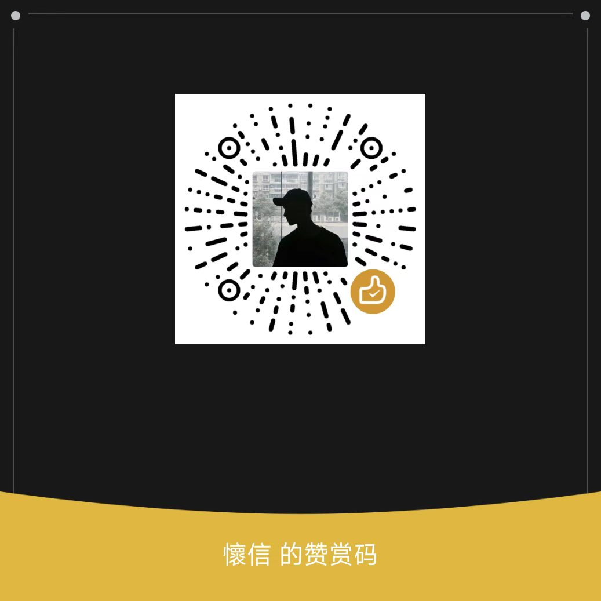

# job_hunter

Boss直聘岗位抓取 SDK —— 基于真实浏览器 Cookie + httpx 纯 API 调用，高速稳定。

[//]: # (> 🚀 **正在开发基于此 SDK 的全自动求职 Agent**，支持智能搜索、智能筛选、简历定制/优化、...)

[//]: # (> 多轮对话管理等功能。关注本仓库获取 Agent 项目最新动态：)

[//]: # (> `https://github.com/2424830124/***` （开发中，Star 关注）)

## ⚠️ 免责声明

**本项目仅供学习和研究使用。** 使用本工具可能违反 Boss直聘 的用户协议，可能导致账号被限制或封禁。使用者需自行承担全部风险和责任，作者不承担任何因使用本工具导致的损失。

请合理控制请求频率，珍惜自己的账号。

---

## 安装

```bash
pip install DrissionPage httpx
```

## 快速开始

```python
from job_hunter import BossZhipin

a = BossZhipin(
    browser_path=r"C:\Program Files (x86)\Microsoft\Edge\Application\msedge.exe",
    user_data_dir=r"./browser_data",   # 浏览器用户数据目录
    output_dir=r"./output",           # 结果保存目录
    log_dir=r"./logs",                # 日志目录
)

# 1. 搜索岗位（支持筛选）
jobs = a.search(keyword="Python", city="杭州")
# 带筛选: a.search(keyword="Python", city="杭州", salary="20-30K", degree="本科", experience="3-5年")
# → [{"security_id":"...", "salary":"20K-40K", ...}]

# 2. 查看详情
sid = jobs[0]["security_id"]
eid = jobs[0]["encrypt_id"]
detail = a.fetch_detail(security_id=sid, encrypt_job_id=eid)
# → {"job":"Python工程师", "detail":"岗位职责...", "skills":[...], ...}

# 3. 打招呼
result = a.contact(security_id=sid)
# → "succeed" 或失败原因（如 "开聊提醒"）

# 4. 会话列表
chats = a.get_chat_list()
# → [{"security_id":"...", "name":"张经理", "company":"某公司", "last_msg":"您好", ...}]

# 5. 面试邀请
interviews = a.get_interviews()

# 6. 简历信息
resume = a.get_resume()

a.close()
```

首次运行会自动打开 Edge 浏览器，登录 Boss直聘 后程序在指定目录生成浏览器用户数据目录，并自动继续。

---

## API

### 构造函数

```python
BossZhipin(
    browser_path: str,       # Edge 浏览器路径（必填）
    user_data_dir: str,      # 浏览器用户数据目录（必填）
    output_dir: str,         # 结果保存目录（必填）
    log_dir: str,            # 日志目录（必填）
    save_results: bool=True, # 是否自动保存 JSON
    console_log: bool=True,  # 是否输出到控制台
    save_log: bool=True,     # 是否写入日志文件
    on_message: callable=None, # GUI 回调 (msg:dict)->None
)
```

### `search(keyword, city="101010100", page=1, pagesize=15, salary=None, experience=None, degree=None, industry=None, scale=None, stage=None, job_type=None) -> list[dict] | None`

关键词搜索岗位。`city` 支持中文名（如"杭州"）或数字编码。
筛选参数支持中文名（如 `salary="20-30K"`, `experience="3-5年"`, `degree="本科"`），也支持数字编码。
返回 `list[dict]`，失败返回 `None`。

返回字段：`security_id`, `encrypt_id`, `degree`, `experience`, `skills`, `salary`, `city`, `company`, `size`, `financing`, `industry`, `dialogue`, `boss_name`, `boss_id`, `area_district`, `business_district`, `job_labels`, `welfare_list`

### `fetch_detail(security_id, encrypt_job_id="") -> dict | None`

查看岗位完整详情。失败返回 `None`。

返回字段：`job`, `detail`(完整JD), `degree`, `experience`, `skills`, `salary`, `city`, `company`, `size`, `financing`, `industry`, `dialogue`, `boss_name`, `boss_id`, `address`, `recruitment_count`, `position_name`, `job_status`, `pay_type`

### `contact(security_id, lid="") -> str | None`

打招呼 / 开始沟通。返回 `"succeed"` 表示成功，否则返回失败原因（如 `"开聊提醒"`），网络异常返回 `None`。

### `get_chat_list() -> list[dict]`

获取全部会话列表。

每条：`security_id`, `name`, `company`, `title`, `last_msg`, `last_time`, `last_sender`("me"/"boss"), `unreplied`

### `get_interviews() -> list[dict] | None`

获取面试邀请列表。失败返回 `None`。

### `get_resume() -> dict | None`

获取我的简历信息。返回 `{"baseinfo": {...}, "expect": {...}}`，失败返回 `None`。

### `close()`

断开浏览器连接。

---

## 架构

采用 Mixin 模式，各功能独立模块：

```
job_hunter/
├── __init__.py        BossZhipin（组合所有 Mixin）
├── core/
│   ├── base.py        BaseMixin：_request/token/retry
│   └── browser.py     BrowserManager：Edge 接管 + Cookie
├── jobs.py            Search + Detail
├── dialogue.py        Chat + Contact + Interview
├── personal.py        Resume
└── assets/            常量/解析/工具
```

---

## 原理

浏览器仅用于提供登录态 Cookie，所有数据通过 httpx 直接调用 Boss直聘 API。

自动处理风控：
- **code=37**：session 过期 → 自动刷新
- **登录失效**：检测到失效关键词 → 自动重新登录
- **网络异常**：内置重试机制

---

## ☕ 打赏

如果这个项目帮到了你，可以请我喝杯咖啡。

| 支付宝                | 微信                |
|--------------------|-------------------|
|  |  |

> 开源不易，你的支持是我持续更新的动力 ❤️

---

## License

MIT
